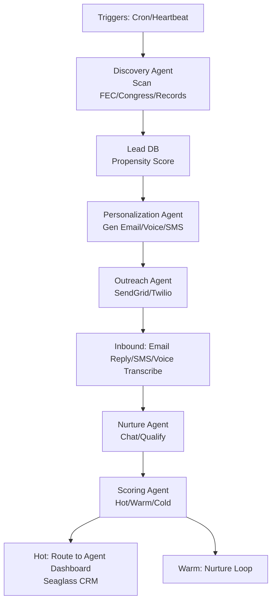

# Congressional AI Lead Engine (CALE) MVP
## Overview
Autonomous multi-agent system for luxury real estate leads in DMV. Scans public DC/gov data for move triggers, personalizes outreach, nurtures via multi-channel, hands off hot leads.

**MVP Scope (60 days)**: Discovery + Personalization + Outreach + basic Nurture. Full scoring in v1.1.

**Tech Stack**:
- LLM: Grok-4-1-fast (xAI)
- Framework: LangChain/LangGraph (agentic workflows)
- Data: Public APIs (FEC, Congress.gov, LinkedIn SalesNav API if avail, property records)
- Channels: SendGrid (email), Twilio (SMS/voice), Telegram/Discord for agent alerts
- Storage: Airtable (leads), PostgreSQL (logs), Redis (state)
- Hosting: Vercel/Railway or VPS w/ cron

**Compliance**: CAN-SPAM, TCPA, DNC lists. Opt-in only; human review high-value.

## Architecture (Mermaid)

